# SPLUNK E-LEARNING — CISCO-SPLUNK

## Splunk Knowledge Objects

### O que são Knowledge Objects?

Por ora, sabemos que *Knowledge Objects* são ferramentas que auxiliam os usuários a descobrir e analisar dados. Neste módulo, vamos aprofundar na criação e manipulação desses objetos!

Os principais tipos de Knowledge Objects são:

- Fields
- Field Extractions
- Field Aliases
- Calculated Fields
- Lookups
- Event Types
- Tags
- Workflow Actions
- Reports
- Alerts
- Macros
- Data Models

---

#### Fields

> **#IMPORTANTE**
>
> Fields (campos) são os blocos de construção de uma pesquisa no Splunk. Quando uma pesquisa é rodada, todos os fields disponíveis ficam visíveis na **barra lateral esquerda** (fields sidebar). Clicar em um desses campos abre a janela de campos, contendo os valores disponíveis para aquele campo.

  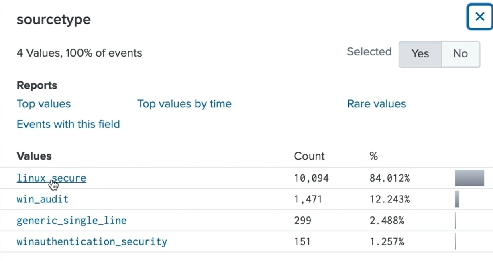

Selecionar um valor da janela do field o adiciona automaticamente à sua pesquisa.

---

#### Field Extractions

> **#IMPORTANTE**
>
> Enquanto diversos fields são extraídos automaticamente no *search time*, você também pode extrair campos manualmente dos seus dados usando **regex** (Regular Expressions) ou **delimitadores**.

  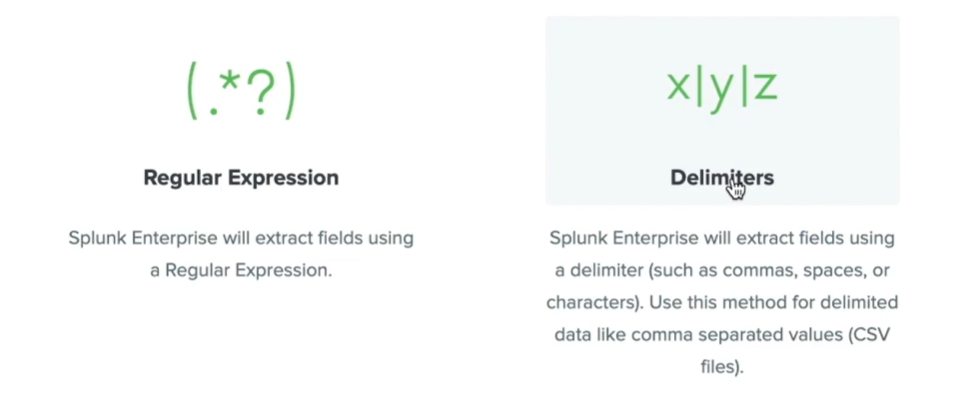

---

#### Field Aliases

  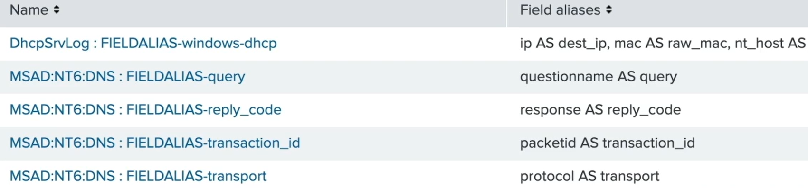

*Field Aliases* permitem normalizar dados ao adicionar um **nome alternativo** para campos existentes. Eles são particularmente úteis quando diferentes *sourcetypes* possuem campos com valores relacionados.

---

#### Calculated Fields

> **#IMPORTANTE**
>
> *Calculated Fields* fazem cálculos baseados nos valores de campos existentes. Seus nomes de campo são criados no *search time* com os valores fornecidos pelo resultado de uma **Eval Expression**, usando valores de campos já existentes.

  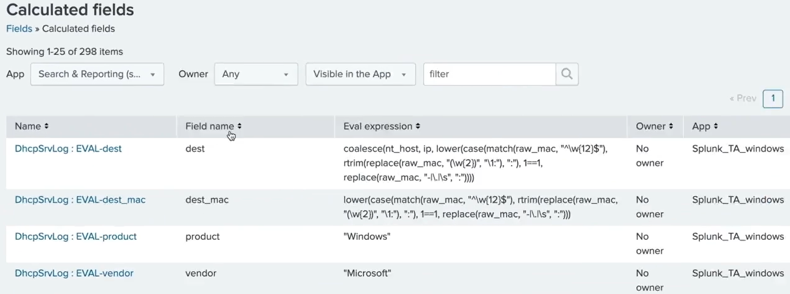

---

#### Lookups

  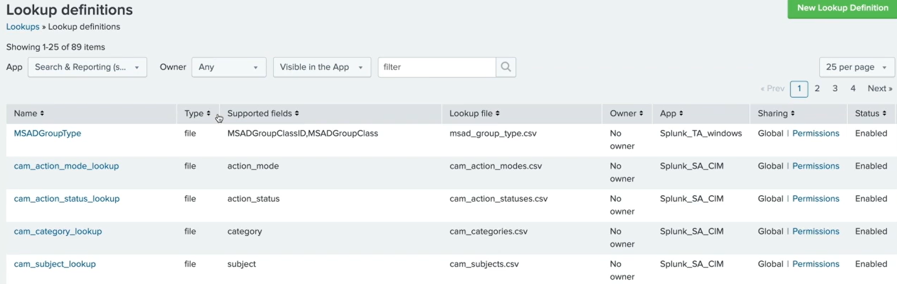

> **#IMPORTANTE**
>
> Campos adicionais e valores que não estão contidos nos seus dados podem ser adicionados aos eventos usando *Lookups*. Eles são baseados em fontes como arquivos **CSV** e podem ser configurados para integrar campos adicionais aos eventos encontrados na sua pesquisa.

---

#### Event Types

  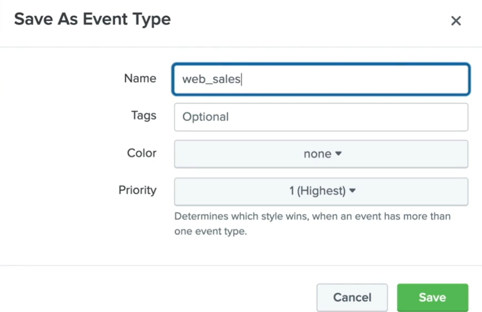

Se você frequentemente utiliza a mesma combinação de termos de pesquisa, pode ser vantajoso salvar sua pesquisa como um *Event Type*. Eles fornecem uma maneira de catalogar seus dados.

Por exemplo, ao salvar um termo de pesquisa como um *event type* chamado `web_sales`, você pode economizar tempo escrevendo simplesmente `event_type=web_sales`.

---

#### Tags

  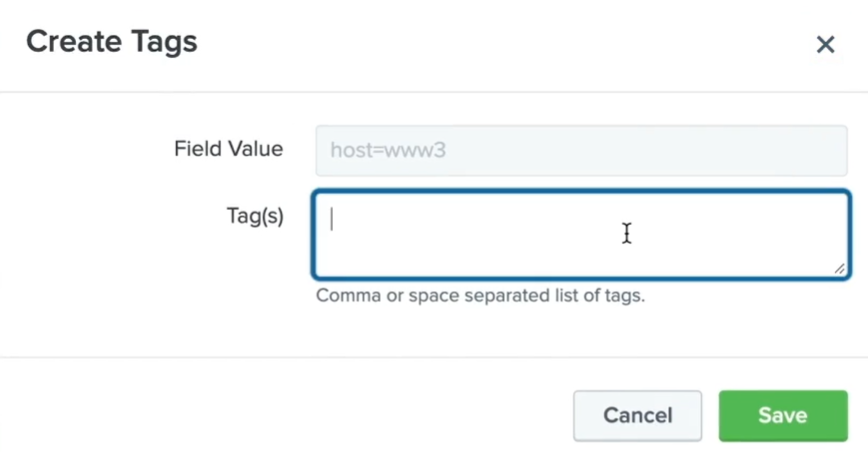

Pares campo-valor (*field-value pairs*) também podem ser salvos como **tags**. Você pode pensar nelas como legendas para seus dados. Tags podem ser usadas em pesquisas da mesma forma que *event types*. Ao clicar em um valor de host, apenas os valores com a tag correspondente são retornados.

*Event Types* e *Tags* também podem ser acessados pelo sidebar esquerdo.

---

#### Workflow Actions

> **#IMPORTANTE**
>
> *Workflow Actions* criam links em eventos que interagem com recursos externos ou aprofundam nossas pesquisas. Eles usam os métodos **HTTP GET** ou **HTTP POST** para passar informações para fontes externas, ou podem passar informações de volta ao Splunk para realizar uma **pesquisa secundária**.

  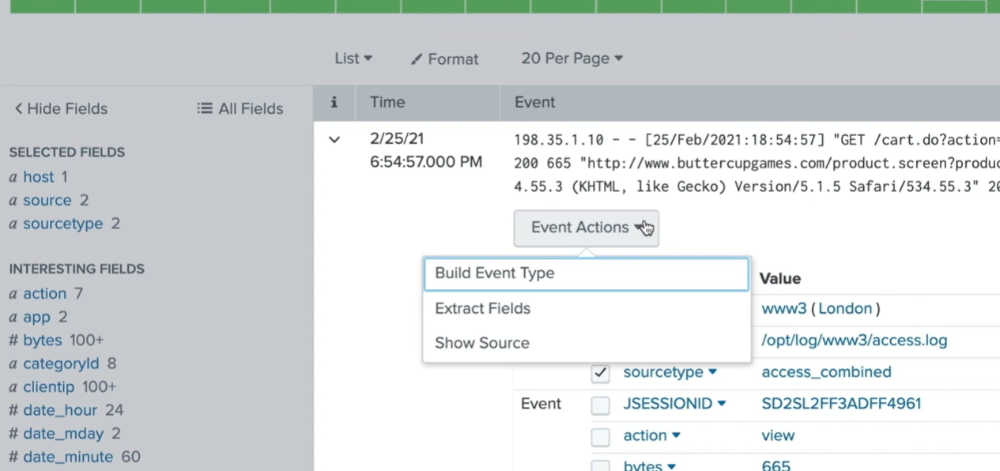

---

#### Reports e Alerts

  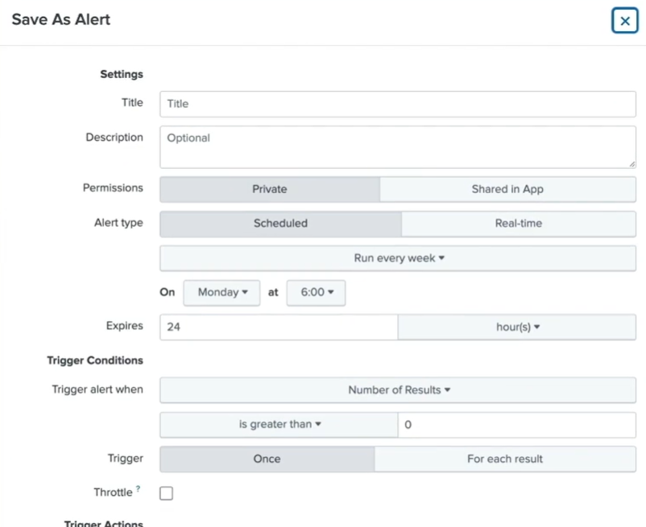

> **#IMPORTANTE**
>
> Pesquisas que você roda constantemente podem ser salvas como **Reports**. Para receber uma notificação quando uma condição de pesquisa ocorrer, você pode salvar sua pesquisa como um **Alert**. Reports e Alerts salvos são muito poderosos e possuem uma grande variedade de *scheduling settings*, permitindo que sejam **agendados para executar em horários específicos**.

---

#### Macros

> **#IMPORTANTE**
>
> *Macros* são *search strings*, ou porções de *search strings*, que podem ser reutilizadas em múltiplos lugares dentro do Splunk. Semelhantes a *event types*, são úteis quando você frequentemente roda pesquisas com requisitos similares ou com sintaxes complexas. **Macros permitem guardar search strings inteiras, incluindo comandos.**

  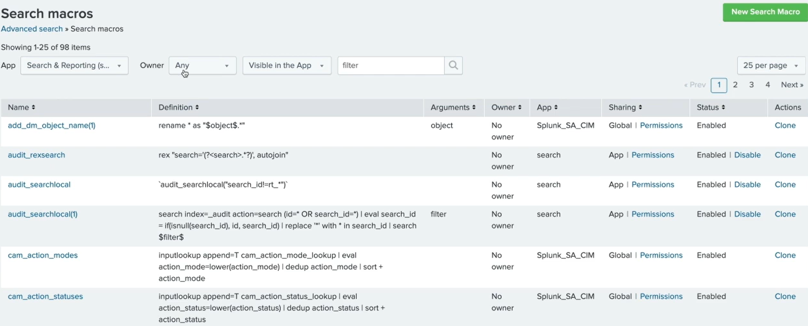

---

#### Data Models

> **#IMPORTANTE**
>
> *Data Models* são datasets estruturados hierarquicamente que podem consistir de três tipos de datasets: **events**, **searches** e/ou **transactions**. Data Models podem ser utilizados no **Pivot**, permitindo que usuários explorem dados em uma interface gráfica sem precisar escrever *SPL (Splunk Search Language)*.

  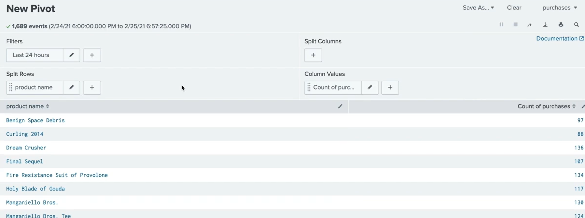

---

### Configurações de Knowledge Objects

Criar tipos específicos de *Knowledge Objects* está fora do escopo deste módulo. Neste segmento, vamos focar nas características que se aplicam a todos os *Knowledge Objects*.

---

#### Convenções de Nomenclatura (Naming Conventions)

Desenvolver convenções de nomenclatura ajuda você e seus usuários a saberem exatamente o que cada *Knowledge Object* faz, mantendo o Splunk organizado. É recomendado nomear objetos usando **seis chaves segmentadas**:

**Grupo · Tipo · Plataforma · Categoria · Tempo · Descrição**

  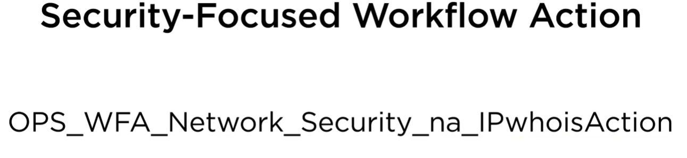

**Exemplo:** Para uma *Security-Focused Workflow Action* criada para o time de operações que retorna informações sobre o IP de um usuário:

| Chave        | Valor           |
|--------------|-----------------|
| Grupo        | OPS             |
| Tipo         | WFA             |
| Plataforma   | Network         |
| Categoria    | Security        |
| Tempo        | na              |
| Descrição    | IPwhoisAction   |

Resultado: `OPS_WFA_Network_Security_na_IPwhoisAction`

---

#### Permissões (Permissions)

> **#IMPORTANTE**
>
> Existem **três opções predefinidas de compartilhamento** para um *Knowledge Object*:
>
> 1. **Private:** Quando um usuário cria um *knowledge object*, ele é automaticamente definido como privado — disponível apenas para quem o criou.
> 2. **Shared in App:** *Power* e *Admin* podem criar *knowledge objects* compartilhados com todos os usuários do app. Também é possível permitir que outras funções leiam e editem o objeto, ou ocultá-lo removendo permissões.
> 3. **Shared in All Apps:** Apenas o **Admin** possui permissão para disponibilizar *Knowledge Objects* para **todos os apps**. Admins também podem ler e editar objetos criados por qualquer função.

  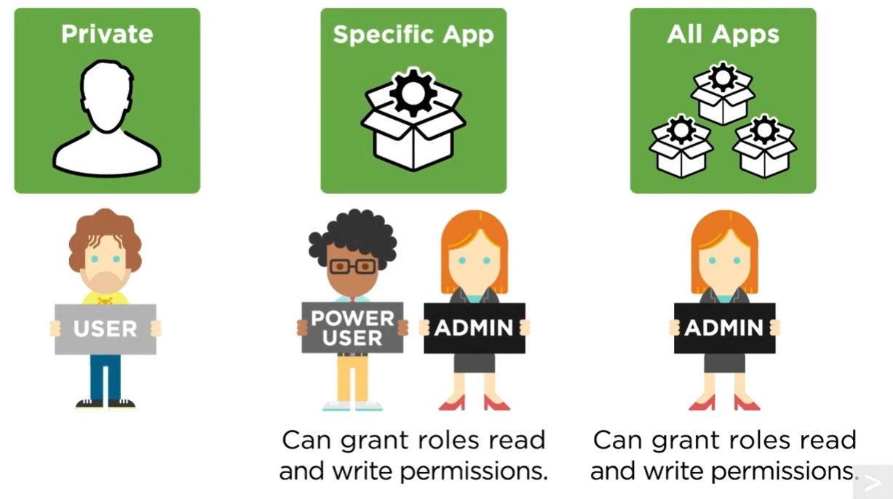

> **#IMPORTANTE**
>
> As funções que podem criar *knowledge objects* são: **Admin**, **Power User** e **User**.

---

### Gerenciando Knowledge Objects

*Knowledge Objects* podem ser gerenciados centralmente no **Knowledge Header**, no menu de configurações.

  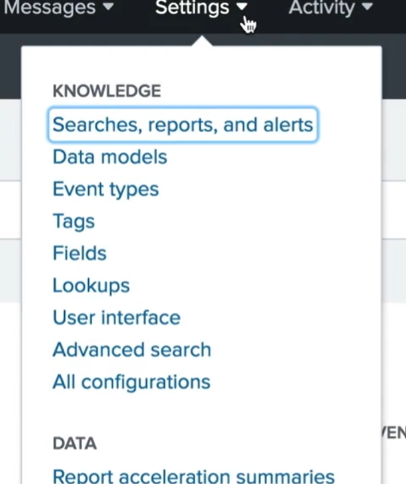

A partir daí, você pode gerenciar objetos por tipo. Na *managing page*, é possível filtrar e ver as ações disponíveis para cada objeto.

  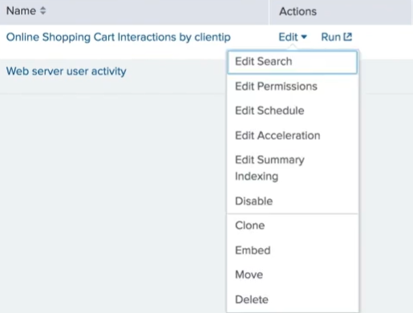

Essas ações incluem mudar permissões, editar, mover e deletar objetos. Sua função determinará sua capacidade de modificar as configurações de um objeto.

  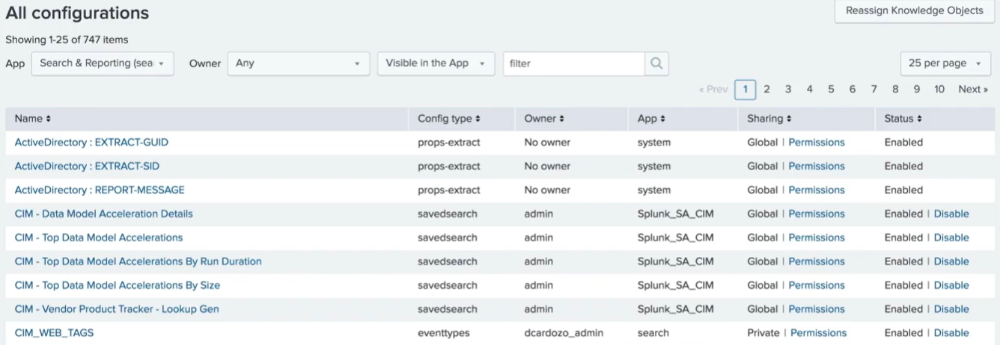

Se não tiver certeza de qual *management page* usar, acesse a página **All Configurations** para visualizar todos os objetos no deployment.

> **#IMPORTANTE**
>
> Usuários com a função de **Admin** verão no canto superior direito o botão **"Reassign Knowledge Object"**, onde *knowledge objects* podem ser **reatribuídos a outro usuário**. Isso é especialmente útil quando um usuário deixa a organização, mas possui *knowledge objects* que devem continuar a existir no deployment.